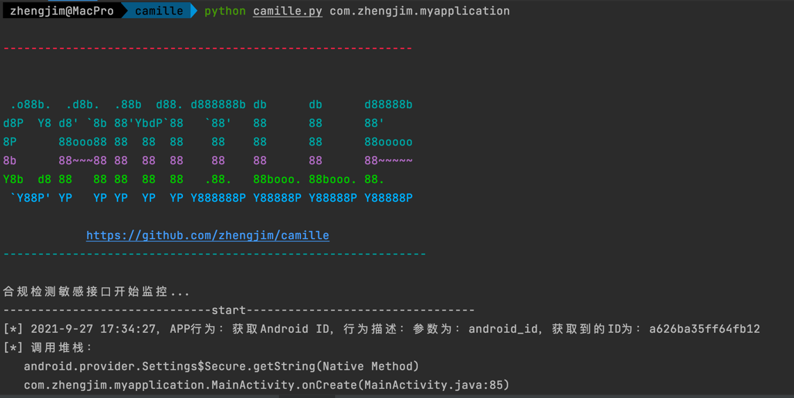
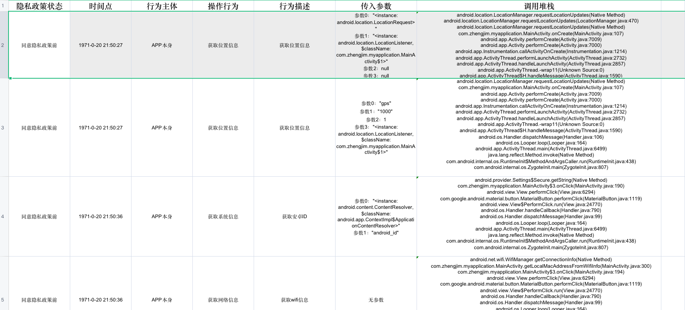
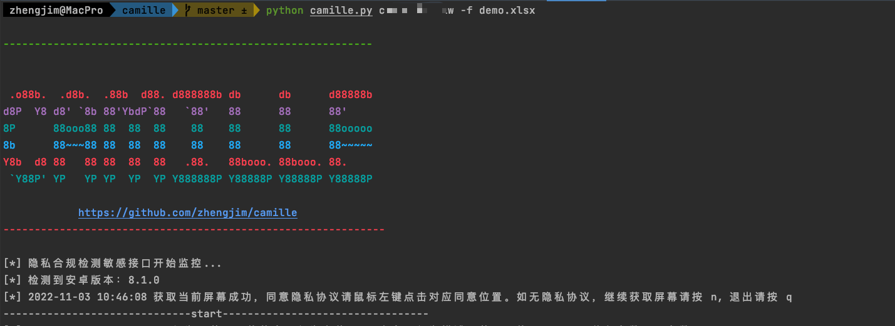
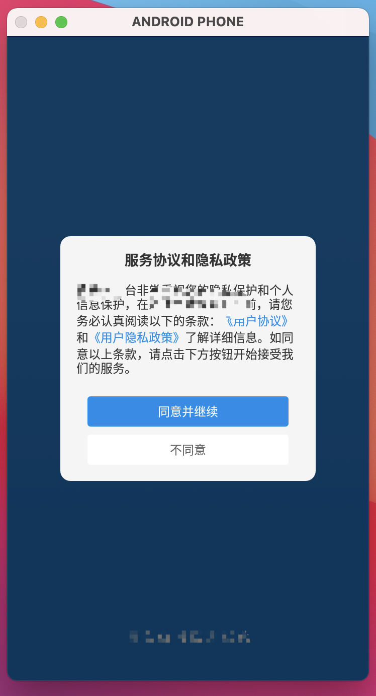

# Camille

Android App隐私合规检测辅助工具

## 简介

现如今APP隐私合规十分重要，各监管部门不断开展APP专项治理工作及核查通报，不合规的APP通知整改或直接下架。camille可以hook住Android敏感接口。根据隐私合规的场景，辅助检查是否符合隐私合规标准。

## 安装

环境：

python3、frida 、一台已root手机(我测试机为Redmi 3s，刷机成魔趣Android 8.1，感觉问题挺多的)，并在手机上运行`frida-server`。

测试了Android 8.1(还测试了魔趣Android 10)，其他版本安卓可能会有bug。

2022-01-14：删除hook短信接口。新增：可指定模块hook或不hook哪些模块。默认不传，全扫描。

2022-06-22：修复程序异常退出、冗余度高、hook接口不全有遗落、新增多个Android版本接口；封装hook方法，新增用户自定义hook方法。

2022-07-08: 默认不开启绕过TracerPid,添加attach hook，避免有些加固包不能hook问题。

2022-09-07：添加讨论群，新增敏感接口，感谢群里师傅@410提供。

2022-11-03: 添加同意隐私合规状态(需人工确认)、第三方SDK识别、可hook构造函数，`methodName`传`'$init'`。方便大家交流，创建交流群。

下载：

```
git clone https://github.com/zhengjim/camille.git
cd camille
pip install -r requirements.txt
python camille.py -h
```


## 用法

简单使用：

```
python camille.py com.zhengjim.myapplication
```



`com.zhengjim.myapplication`为测试app的包名，会显示时间、行为和调用堆栈。可以根据场景来判断是否合规，如：获取敏感信息是否是在同意隐私政策之前等。

```
python camille.py com.zhengjim.myapplication -ns -f demo01.xls
```

- -ns：不显示日志。默认显示
- -f： 保存app行为轨迹到到execl里。默认不保存。



```
python camille.py com.zhengjim.myapplication -t 3
```

- -t： hook应用自己的函数或含壳时，建议使用setTimeout并给出适当的延时(1-5s，需要根据不同app进行调整)。以免hook失败。默认不延迟。

如下图：不加延迟hook失败。


加了延迟hook成功。


- -ia：使用attach hook

假如还是hook不上，可以使用`-ia`，指定包名或运行进程ID。 有些包有同名进程，frida会hook失败，需要使用进程ID。

找进程ID，进入安卓运行`ps -A | grep com.zhengjim.myapplication`


- -u： 扫描指定模块。与命令`-nu`互斥。多个模块用','隔开。例如：phone,permission

**模块列表：**

| 模块名 | 备注 |
| ------ | ------ |
|permission|申请权限|
|phone|电话、基站|
|system|系统信息(AndroidId/标识/content敏感信息)|
|app|其他app信息|
|location|位置信息|
|network|getNetwork|
|camera|照相机|
|bluetooth|蓝牙|
|file|文件|
|custom| 用户自定义接口|

- -nu：跳过扫描指定模块。与命令`-u`互斥。多个模块用','隔开。例如：phone,permission 模块列表同上

## 自定义hook接口

在`script.js`文件里的`customHook`方法里可自行添加需要hook的接口。

如hook`com.zhengjim.myapplication.HookTest`类的`getPassword`和`getUser`方法。如下：

```
hook('com.zhengjim.myapplication.HookTest', [
    {'methodName': 'getPassword', 'action': action, 'messages': '获取zhengjim密码'},
    {'methodName': 'getUser', 'action': action, 'messages': '获取zhengjim用户名'},
]);
```

`-u custom`是只检测自定义接口，如图：


## 是否同意隐私政策

默认开启， 如不需要改功能加`-npp` 参数关闭（不开启的话就默认是同意隐私合规后）。采用半自动模式，启动后会弹出当前屏幕。



同意隐私协议请`鼠标左键`点击对应同意位置如无隐私协议，如不是隐私协议界面继续获取屏幕请按键盘`n`, 退出请按`q` 




查看报告


## 后记

本来想使用uiautomator2或appium来模拟点击制定场景，~~但后续调研发现纯自动化的检测是不全的，最多也就检测20-30%，还是得结合人工来检测。索性就删除了模拟点击这块。~~(其实就是懒，不定期更新)

## 场景

**参考百度史宾格的检测场景，根据工信部信管函〔2020〕164号文（共37项），需要人工自查的有11项**

网站：https://console.bce.baidu.com/springer (~~现在1.2元/次，挺划算的，嫌麻烦的直接用就行。~~ 已经1000元/次)

### 1 APP、SDK违规处理用户个人信息方面

#### 1.1 违规收集个人信息。重点整治APP、SDK未告知用户收集个人信息的目的、方式、范围且未经用户同意，私自收集用户个人信息的行为。

- 场景1：APP未见向用户明示个人信息收集使用的目的、方式和范围，未经用户同意，存在收集IMEI、设备MAC地址和软件安装列表、通讯录和短信等信息的行为。
- 场景2：APP以隐私政策弹窗的形式向用户明示收集使用规则，未经用户同意，存在收集设备MAC地址、IMEI等信息的行为。
- 场景3：APP以隐私政策弹窗的形式向用户明示收集使用规则，但未见清晰明示APP收集软件列表、设备MAC地址等的目的方式范围，用户同意隐私政策后，存在收集软件列表、设备MAC地址的行为。
- 场景4：APP未见向用户明示SDK收集使用个人信息的目的、方式和范围，未经用户同意，SDK存在收集IMEI、设备MAC地址和软件安装列表、通讯录和短信等信息的行为。
- 场景5：APP向用户明示SDK的收集使用规则，未经用户同意，SDK存在收集IMEI、设备MAC地址和软件安装列表、通讯录和短信等信息的行为。
- 场景6：APP向用户明示SDK的收集使用规则，但未见清晰明示SDK收集设备MAC地址、软件安装列表等的目的方式范围，用户同意隐私政策后， SDK存在收集设备MAC地址、软件安装列表的行为。
- 场景7：APP在征求用户同意环节，未提供明确的同意或拒绝按钮，或者使用“好的”“我知道了”等词语。
- 场景8：APP在征求用户同意环节，设置为默认勾选。

#### 1.2 超范围收集个人信息。重点整治APP、SDK非服务所必需或无合理应用场景，特别是在静默状态下或在后台运行时，超范围收集个人信息的行为。

- 场景1(人工自查)：APP存在收集IMEI、IMSI、设备MAC地址、软件安装列表、位置、联系人、通话记录、日历、短信、本机电话号码、图片、音视频等个人信息的行为，非服务所必需且无合理应用场景。
-
场景2：APP在运行时，未见向用户告知且未经用户同意，存在以特定频率（如每30s）读取收集IMEI、IMSI、设备MAC地址、软件安装列表、位置、联系人、通话记录、日历、短信、本机电话号码、图片、音视频等个人信息，非服务所必需且无合理应用场景，超出实现产品或服务的业务功能所必需的最低频率。
- 场景3(人工自查)
  ：APP未见向用户明示SDK的收集使用规则，未经用户同意，SDK存在收集IMEI、IMSI、设备MAC地址、软件安装列表、位置、联系人、通话记录、日历、短信、本机电话号码、图片、音视频等信息的行为，非服务所必需且无合理应用场景，超出与收集个人信息时所声称的目的具有直接或合理关联的范围。
- 场景4：APP在运行时，未见向用户告知且未经用户同意，存在每2秒读取一次IMEI、位置信息等，非服务所必需且无合理应用场景，超出实现产品或服务的业务功能所必需的最低频率。
- 场景5：APP未见向用户告知且未经用户同意，在后台行为时，存在收集 IMSI、设备序列号等信息的行为，非服务所必需且无合理应用场景，超出与收集个人信息时所声称的目的具有直接或合理关联的范围。
- 场景6：APP未见向用户告知且未经用户同意，在静默状态下或在后台运行时，存在按照一定频次收集位置信息、IMEI、通讯录、短信、图片等信息的行为，非服务所必需且无合理应用场景，超出与收集个人信息时所声称的目的具有直接或合理关联的范围。
- 场景7：APP未向用户明示SDK的收集使用规则，未经用户同意，SDK在静默状态下或在后台运行时，存在收集通讯录、短信、通话记录、相机等信息的行为，非服务所必需且无合理应用场景，超出与收集个人信息时所声称的目的具有直接或合理关联的范围。
-
场景8：APP未向用户明示SDK的收集使用规则，未经用户同意，SDK在静默状态下或在后台运行时，存在按照一定频次收集位置信息、IMEI、通讯录、短信、图片等信息的行为，非服务所必需且无合理应用场景，超出与收集个人信息时所声称的目的具有直接或合理关联的范围。

#### 1.3 违规使用个人信息。重点整治APP、SDK未向用户告知且未经用户同意，私自使用个人信息，将用户个人信息用于其提供服务之外的目的，特别是私自向其他应用或服务器发送、共享用户个人信息的行为。

- 场景1：APP未向用户明示个人信息处理的目的、方式和范围，将IMEI、IMSI、设备MAC地址、软件安装列表、位置、联系人、通话记录、日历、短信、本机电话号码、图片、音视频等个人信息发送给第三方SDK等产品或服务。
- 场景2：APP未见向用户明示分享的第三方名称、目的及个人信息类型，用户同意隐私政策后，存在将IMEI/设备MAC地址/软件安装列表等个人信息发送给第三方SDK。
- 场景3(人工自查)：APP未向用户告知且未经用户同意，将设备识别信息、商品浏览记录、搜索使用习惯、软件安装列表等个人信息传输至APP服务器后，向第三方产品或服务提供其收集的个人信息。

#### 1.4 强制用户使用定向推送功能。重点整治APP、SDK未以显著方式标示且未经用户同意，将收集到的用户搜索、浏览记录、使用习惯等个人信息，用于定向推送或广告精准营销，且未提供关闭该功能选项的行为。

- 场景1：APP的页面或功能存在定向推送功能，但隐私政策未见向用户告知，将收集的用户个人信息用于定向推送、精准营销。
- 场景2(人工自查)：若APP定向推送功能使用了第三方的个人信息来源，但隐私政策未见向用户告知。
- 场景3(人工自查)：APP隐私政策存在“根据您的偏好进行个性化推荐”等内容，明示存在定向推送功能，但页面中未见显著区分个性化推送服务，如标明“个性化展示”或“定推”等字样。
- 场景4(人工自查)：APP以隐私政策弹窗等形式明示存在定向推送功能，未提供退出或关闭个性化展示模式的选项，如拒绝接受定向推送信息，或停止、退出、关闭相应功能的机制。

### 2 设置障碍、频繁骚扰用户方面

#### 2.1 APP强制、频繁、过度索取权限。重点整治APP安装、运行和使用相关功能时，非服务所必需或无合理应用场景下，用户拒绝相关授权申请后，应用自动退出或关闭的行为。重点整治短时长、高频次，在用户明确拒绝权限申请后，频繁弹窗、反复申请与当前服务场景无关权限的行为。重点整治未及时明确告知用户索取权限的目的和用途，提前申请超出其业务功能等权限的行为。

- 场景1：APP首次启动时，向用户索取电话、通讯录、定位、短信、录音、相机、存储、日历等权限，用户拒绝授权后，应用退出或关闭（应用陷入弹窗循环，无法正常使用）。
- 场景2(人工自查)：APP运行时，未向用户告知申请权限的目的，向用户索取当前服务场景未使用到的通讯录、定位、短信、录音、相机、日历等权限，且用户拒绝授权后，应用退出或关闭相关功能，无法正常使用。
- 场景3(人工自查)：用户注册登录时，APP向用户索取电话、通讯录、定位、短信、录音、相机、存储、日历等权限，用户拒绝授权后，APP无法正常注册或登录。
- 场景4(人工自查)：APP运行时，向用户索取当前服务场景未使用到的电话、通讯录、定位、短信、录音、相机、存储、日历等权限，且用户拒绝授权后，应用退出或关闭（应用陷入弹窗循环，无法正常使用）。
- 场景5：APP运行时，在用户明确拒绝通讯录、定位、短信、录音、相机、日历等权限申请后，仍向用户频繁弹窗申请与当前服务场景无关的权限，影响用户正常使用。
- 场景6： APP在用户明确拒绝通讯录、定位、短信、录音、相机等权限申请后，重新运行时，仍向用户弹窗申请开启与当前服务场景无关的权限，影响用户正常使用。
- 场景7：APP首次打开或运行中，未见使用权限对应的相关功能或服务时，不应提前向用户弹窗申请开启通讯录、定位、短信、录音、相机、日历等权限。
- 场景8(人工自查)：APP未见提供相关业务功能或服务，不应申请通讯录、定位、短信、录音、相机、日历等权限。

#### 2.2 APP频繁自启动和关联启动。重点整治APP未向用户告知且未经用户同意，或无合理的使用场景，频繁自启动或关联启动第三方APP的行为。

- 场景1：APP未向用户明示未经用户同意，且无合理的使用场景，存在频繁自启动或关联启动的行为。
- 场景2：APP虽然有向用户明示并经用户同意环节，但频繁自启动或关联启动发生在用户同意前。
- 场景3：APP非服务所必需或无合理应用场景，超范围频繁自启动或关联启动第三方APP。

### 3 欺骗误导用户方面

#### 3.1 欺骗误导用户下载APP。通过“偷梁换柱”“移花接木”等方式欺骗误导用户下载APP，特别是具有分发功能的移动应用程序欺骗误导用户下载非用户所自愿下载APP的行为

- 场景1：APP 广告页面、开屏广告、主屏等功能页面，无显著APP下载提示，点击即自动下载非用户所自愿下载APP。
- 场景2：APP 广告页面、开屏广告、主屏等功能页面，以“是否立即开始游戏”方式欺骗误导用户自动下载非用户所自愿下载APP。
- 场景3：APP 广告页面、开屏广告、主屏等功能页面，以“领取红包”方式欺骗误导用户自动下载非用户所自愿下载APP。
- 场景4：APP 广告页面、开屏广告、主屏等功能页面，点击“下载按钮“以外区域，自动下载非用户所自愿下载APP。
- 场景5(人工自查)：暂停下载非用户所自愿下载APP，关闭并重新运行本APP后，自动恢复下载被暂停的非用户所自愿下载的APP。
- 场景6(人工自查)：APP 广告页面、开屏广告、主屏等功能页面，通过设置关闭障碍等方式欺骗误导强迫下载非用户所自愿下载APP。
- 场景7(人工自查)：APP 广告页面、开屏广告、主屏等功能页面，下载的APP与向用户所作的宣传或者承诺不符。

#### 3.2 欺骗误导用户提供个人信息。

- 行为表现：非服务所必需或无合理场景，通过积分、奖励、优惠等方式欺骗误导用户提供身份证号码以及个人生物特征信息的行为。

## 参考链接

- https://github.com/Dawnnnnnn/APPPrivacyDetect
- https://github.com/r0ysue/r0capture/
- https://github.com/ChenJunsen/Hegui3.0


## 讨论群

感谢[@You-guess-guess](https://github.com/You-guess-guess) 提供的App合规检测交流群，有需要的可以加群交流~

为方便大家交流，创建交流群有需要的加群。后续过期加V，备注github。就会拉进群。


## Stargazers over time

[](https://www.zhengjim.com)

[](https://starchart.cc/zhengjim/camille)


